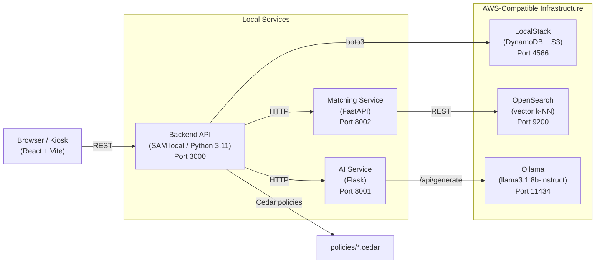

# Kalaa Setu — Rural Artisan Marketplace

> **WeMakeDevs × AWS First Commit Hackathon · Sept 17–20, 2026**

Kalaa Setu ("art bridge" in Hindi) is a hyperlocal marketplace that connects rural artisans with buyers using voice-first onboarding, AI-generated listings, and Amazon Web Services open-source technology — all running entirely offline on a local kiosk.

---

## The Problem

India's rural artisans (potters, weavers, toy-makers, food producers) have no practical route to market. They are often illiterate in English, have no smartphone, and live far from cities. Existing e-commerce platforms require:
- A smartphone and reliable internet
- Written product descriptions in English
- A bank account tied to the platform

Millions of artisans are excluded before they can list a single product.

---

## The Solution

A kiosk-based platform operated at schools and community service centers (CSCs). A field agent sits with the seller and runs a Hindi-language voice conversation. The AI extracts product details, generates a bilingual listing, enforces access-control policies, and matches it to nearby buyer demand — all without the seller touching a keyboard.

<TODO: add demo video link once recorded>

---

## Features

| Feature | Where in code |
|---|---|
| Hindi-language conversational onboarding | `ai/src/conversation.py`, `frontend/src/components/onboarding/` |
| AI listing generation (title, price, story, compliance flags) | `ai/src/listing_generator.py` |
| Vector similarity buyer–seller matching (OpenSearch k-NN) | `matching/app/` |
| Cedar policy enforcement (edit-own, contribution opt-in, buyer privacy) | `backend/src/cedar/`, `policies/*.cedar` |
| Community contribution opt-in (seller keeps 1–100% for a local cause) | `backend/src/handlers/contributions.py`, `policies/contribution_opt_in.cedar` |
| Ledger: transparent per-sale breakdown (sale / fee / net / contribution) | `backend/src/handlers/ledger.py`, `frontend/src/components/ledger/` |
| Live impact dashboard (village-level aggregate stats) | `backend/src/handlers/impact.py`, `frontend/src/pages/ImpactPage.jsx` |
| Works without real AWS (LocalStack emulates DynamoDB + S3 locally) | `docker-compose.yml`, `backend/src/db/dynamodb.py` |

---

## Architecture



---

## AWS Services Used

All services below are open-source AWS technologies that run **locally** — no AWS account or billing is required for the demo.

| AWS Technology | What Kalaa Setu uses it for | Key files |
|---|---|---|
| **Amazon DynamoDB** (via LocalStack) | Stores all domain data: Sellers, Listings, Buyers, LedgerEntries, Contributions, Products, Reviews, SearchIntents, CommunityTouchpoints | `backend/src/db/dynamodb.py`, `data/seed/dynamodb_seed.json`, `docker-compose.yml` |
| **Amazon S3** (via LocalStack) | Reserved for listing images (seeded bucket; upload flow is a stretch feature) | `docker-compose.yml` (`SERVICES=dynamodb,s3,...`), `backend/template.yaml` |
| **AWS SAM (Serverless Application Model)** | Defines the backend API as serverless Lambda functions; `sam local start-api` emulates API Gateway locally | `backend/template.yaml` (11 Lambda functions), `scripts/start-all.sh` |
| **Amazon OpenSearch** (open-source) | Vector k-NN search: indexes listing embeddings, finds the closest matches to a buyer's query text | `matching/app/`, `docker-compose.yml` (`opensearch` service), `data/seed/opensearch_seed.json` |
| **AWS Cedar** (open-source policy language) | Enforces four access-control policies: seller edits own listing only, contribution requires opt-in, buyer cannot view seller financials, touchpoint admin scope | `policies/*.cedar`, `backend/src/cedar/` |

---

## Tech Stack

| Layer | Technology |
|---|---|
| Frontend | React 18.3.1, Vite 5.4.0, react-router-dom 6.26.0 |
| Backend | Python 3.11, AWS SAM CLI, Flask (AI service), FastAPI (Matching service) |
| AI / LLM | Ollama (`llama3.1:8b-instruct`), direct HTTP calls — no external API key required |
| Vector search | OpenSearch 2.13.0, `sentence-transformers/all-MiniLM-L6-v2` embeddings |
| Auth / AuthZ | AWS Cedar (Python evaluator — no Cedar binary required, `CEDAR_MODE=mock`) |
| Data store | DynamoDB via LocalStack 3.4.0 |
| Testing | Vitest 2.0.5 + React Testing Library (frontend); pytest (backend — 34 tests) |
| Languages | JavaScript/JSX (frontend), Python (backend/ai/matching) |

---

## Getting Started

### Prerequisites

- Docker + Docker Compose v2
- Node.js 18+
- Python 3.11+
- AWS SAM CLI (`brew install aws-sam-cli` or see [SAM docs](https://docs.aws.amazon.com/serverless-application-model/latest/developerguide/install-sam-cli.html))
- Ollama (`brew install ollama` or [ollama.com](https://ollama.com))

### 1. Clone and configure

```bash
git clone <TODO: your-repo-url>
cd kalaa_setu_unified
cp .env.example .env        # defaults work as-is for local dev
```

### 2. Pull the LLM model (once)

```bash
ollama pull llama3.1:8b-instruct
```

The Matching service also downloads `all-MiniLM-L6-v2` (~90 MB) from Hugging Face on first run. Internet required once; cached after that.

### 3. Install dependencies

```bash
# Frontend
cd frontend && npm install && cd ..

# AI service
cd ai && python3 -m venv venv && source venv/bin/activate && pip install -r requirements.txt && deactivate && cd ..

# Backend
cd backend && python3 -m venv .venv && source .venv/bin/activate && pip install -r requirements.txt && deactivate && cd ..

# Matching service
cd matching && python3 -m venv .venv && source .venv/bin/activate && pip install -r requirements.txt && deactivate && cd ..
```

### 4. Start everything

```bash
bash scripts/start-all.sh
```

This starts (in order): LocalStack + OpenSearch → Ollama → AI service → Matching service → Backend (SAM) → Frontend.

Logs land in `.logs/`. Services are ready when:
- `curl http://localhost:4566/_localstack/health` shows `"dynamodb": "running"`
- `curl http://localhost:9200/_cluster/health` shows `"status":"green"` or `"status":"yellow"`
- `curl http://localhost:8001/health` → `{"status": "ok"}`
- `curl http://localhost:8002/health` → `{"status": "ok"}`

### 5. Seed the database

```bash
python3 scripts/seed_dynamodb.py
python3 scripts/seed_opensearch.py
```

### 6. Open the app

```
http://localhost:5173
```

---

## Cedar Policy Decisions

Four policies enforce the access-control rules the platform promises to artisans:

| Policy file | What it enforces |
|---|---|
| `policies/seller_edit_own_listing.cedar` | A seller may only edit their own listing — never another seller's |
| `policies/contribution_opt_in.cedar` | A community contribution may only be routed if the seller has explicitly opted in; percentage must be 0–100 |
| `policies/buyer_financial_privacy.cedar` | Buyers cannot view any seller financial data (ledger, net, fees); they can only view the public impact aggregate |
| `policies/touchpoint_admin_scope.cedar` | Touchpoint admins can only act within their own touchpoint's scope |

The Cedar evaluator runs in Python (`backend/src/cedar/`) — no Cedar binary or Rust toolchain required.

---

## UX Decisions

- **Hindi-first**: the onboarding conversation starts in Hindi by default; English is a secondary option. Rural artisans are the primary user.
- **Keyboard-optional**: the seller setup form uses `type="tel"`, `autoComplete`, and large (44px) tap targets so a field agent can complete it on a tablet.
- **Accessibility**: skip-to-content link, `aria-live="polite"` on chat messages, semantic HTML throughout.
- **Honest ledger**: every sale shows four numbers (sale / fee / net / contribution) so sellers always know exactly what they receive.
- **Contribution is truly opt-in**: the Cedar policy physically prevents routing a contribution unless `opted_in == true`.

---

## AI Tools Used

<TODO: list specific AI tools your team used during development — e.g. Claude Code, GitHub Copilot, ChatGPT — and what you used each one for>

---

## What We Learned

<TODO: replace with genuine personal reflections — what surprised you, what you'd do differently, what new skill you picked up>

---

## Impact

Kalaa Setu targets artisans who are currently unreachable by any existing marketplace. The design choices — local LLM, no cloud dependency, kiosk-first, Hindi-first — are direct responses to the constraints of rural India.

<TODO: add verifiable impact numbers or user-testing results if you conduct any before submission>

---

## Team

<TODO: team member names, roles, and GitHub handles>

---

## License

MIT — see [LICENSE](./LICENSE).

---

## Credits

- [LocalStack](https://localstack.cloud) — local AWS emulation
- [OpenSearch](https://opensearch.org) — open-source vector search
- [Cedar](https://www.cedarpolicy.com) — open-source policy language by AWS
- [Ollama](https://ollama.com) — local LLM runtime
- [sentence-transformers](https://www.sbert.net) — `all-MiniLM-L6-v2` embedding model
- [React](https://react.dev), [Vite](https://vitejs.dev), [AWS SAM CLI](https://aws.amazon.com/serverless/sam/)


### Reset the local demo

With LocalStack and the matching service running, run `bash scripts/demo-reset.sh`. The script is guarded to refuse non-local DynamoDB endpoints, clears/reseeds DynamoDB and the matching index, and reminds you that AI conversations are in memory and are cleared by restarting the AI service.
