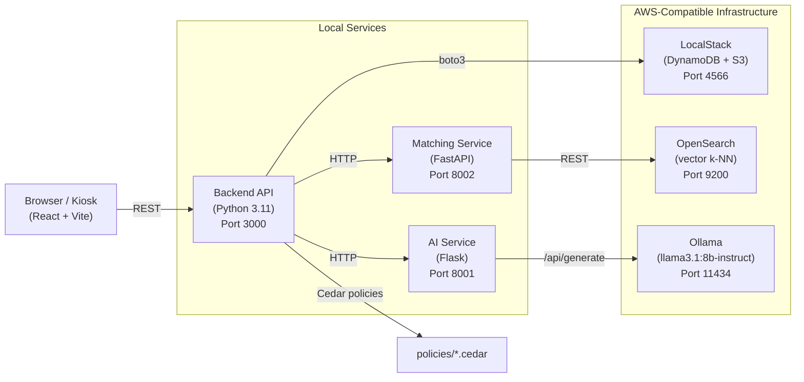

# Kalaa Setu — Rural Artisan Marketplace

> **WeMakeDevs × AWS First Commit Hackathon · Sept 17–20, 2026**

Kalaa Setu ("art bridge" in Hindi) is a hyperlocal marketplace that connects rural artisans with buyers using voice-first onboarding, AI-assisted listings, and Amazon Web Services open-source technology — all running locally on a kiosk-oriented environment.

---

## The Problem

India's rural artisans can face major barriers to entering digital commerce. Existing e-commerce platforms often require:
- A smartphone and reliable internet
- Written product descriptions and digital forms
- Familiarity with online selling workflows
- Product discoverability and marketplace skills

Kalaa Setu addresses the gap between having a valuable handmade product and being able to represent, discover, and sell that product digitally.

---

## The Solution

A kiosk-based platform operated at schools and community service centers (CSCs). A field agent can sit with the seller and run a Hindi-language voice conversation. The AI extracts product details, generates a structured bilingual listing, applies access-control policies, and connects listings with buyer demand — without requiring the artisan to manage a conventional e-commerce interface.

The complete journey is:

**Artisan → Voice Onboarding → AI-Assisted Listing → Product Discovery → Sale → Seller Ledger → Community Impact**

---

## Features

| Feature | Where in code |
|---|---|
| Hindi-language conversational onboarding | `ai/src/conversation.py`, `frontend/src/components/onboarding/` |
| AI listing generation (title, price, story, compliance flags) | `ai/src/listing_generator.py` |
| Vector similarity buyer–seller matching (OpenSearch k-NN) | `matching/app/` |
| Cedar policy enforcement (edit-own, contribution opt-in, buyer privacy) | `backend/src/cedar/`, `policies/*.cedar` |
| Community contribution opt-in (seller keeps 1–100% for a local cause) | `backend/src/handlers/contributions.py`, `policies/contribution_opt_in.cedar` |
| Ledger: transparent per-sale breakdown (sale / fee / net / contribution) | `backend/src/handlers/ledger.py`, `frontend/src/components/ledger/` |
| Live impact dashboard (village-level aggregate stats) | `backend/src/handlers/impact.py`, `frontend/src/pages/ImpactPage.jsx` |
| Works without real AWS (LocalStack emulates DynamoDB + S3 locally) | `docker-compose.yml`, `backend/src/db/dynamodb.py` |

---

## Architecture



---

## AWS Services Used

All services below are used through a local development/demo environment. LocalStack provides AWS-compatible local emulation, so the demo does not require an AWS account or billing.

| AWS Technology | What Kalaa Setu uses it for | Key files |
|---|---|---|
| **Amazon DynamoDB** (via LocalStack) | Stores domain data: Sellers, Listings, Buyers, LedgerEntries, Contributions, Products, Reviews, SearchIntents, CommunityTouchpoints | `backend/src/db/dynamodb.py`, `data/seed/dynamodb_seed.json`, `docker-compose.yml` |
| **Amazon S3** (via LocalStack) | Provides local AWS-compatible object storage reserved for listing images | `docker-compose.yml`, `backend/template.yaml` |
| **AWS SAM (Serverless Application Model)** | Defines the backend API and Lambda-oriented architecture for local/serverless development | `backend/template.yaml`, `scripts/start-all.sh` |
| **Amazon OpenSearch** (open-source) | Vector k-NN search: indexes listing embeddings and finds relevant matches for buyer queries | `matching/app/`, `docker-compose.yml`, `data/seed/opensearch_seed.json` |
| **AWS Cedar** (open-source policy language) | Enforces four access-control policies covering seller listing edits, contribution opt-in, buyer financial privacy, and touchpoint admin scope | `policies/*.cedar`, `backend/src/cedar/` |

---

## Tech Stack

| Layer | Technology |
|---|---|
| Frontend | React 18.3.1, Vite 5.4.0, react-router-dom 6.26.0 |
| Backend | Python 3.11, AWS SAM architecture, Flask (AI service), FastAPI (Matching service) |
| AI / LLM | Ollama (`llama3.1:8b-instruct`), direct local HTTP calls — no external API key required |
| Vector search | OpenSearch 2.13.0, `sentence-transformers/all-MiniLM-L6-v2` embeddings |
| Auth / AuthZ | AWS Cedar (Python evaluator — no Cedar binary required, `CEDAR_MODE=mock`) |
| Data store | DynamoDB via LocalStack 3.4.0 |
| Testing | Vitest 2.0.5 + React Testing Library (frontend); pytest (backend — 34 tests) |
| Languages | JavaScript/JSX (frontend), Python (backend/ai/matching) |

---

## Getting Started

### Prerequisites

- Docker + Docker Compose v2
- Node.js 18+
- Python 3.11+
- AWS SAM CLI (`brew install aws-sam-cli` or see [SAM docs](https://docs.aws.amazon.com/serverless-application-model/latest/developerguide/install-sam-cli.html))
- Ollama (`brew install ollama` or [ollama.com](https://ollama.com))

### 1. Clone and configure

```bash
git clone https://github.com/KartikaySrivastava258/incredible-india.git
cd incredible-india
cp .env.example .env        # defaults work as-is for local dev
```

### 2. Pull the LLM model (once)

```bash
ollama pull llama3.1:8b-instruct
```

The Matching service also downloads `all-MiniLM-L6-v2` (~90 MB) from Hugging Face on first run. Internet is required once; the model is cached after download.

### 3. Install dependencies

```bash
# Frontend
cd frontend && npm install && cd ..

# AI service
cd ai && python3 -m venv venv && source venv/bin/activate && pip install -r requirements.txt && deactivate && cd ..

# Backend
cd backend && python3 -m venv .venv && source .venv/bin/activate && pip install -r requirements.txt && deactivate && cd ..

# Matching service
cd matching && python3 -m venv .venv && source .venv/bin/activate && pip install -r requirements.txt && deactivate && cd ..
```

### 4. Start everything

```bash
bash scripts/start-all.sh
```

This starts the local stack in order: LocalStack + OpenSearch → Ollama → AI service → Matching service → Backend → Frontend.

Logs land in `.logs/`. Services are ready when:
- `curl http://localhost:4566/_localstack/health` shows `"dynamodb": "running"`
- `curl http://localhost:9200/_cluster/health` shows `"status":"green"` or `"status":"yellow"`
- `curl http://localhost:8001/health` → `{"status": "ok"}`
- `curl http://localhost:8002/health` → `{"status": "ok"}`

### 5. Seed the database

```bash
python3 scripts/seed_dynamodb.py
python3 scripts/seed_opensearch.py
```

### 6. Open the app

```text
http://localhost:5173
```

---

## Cedar Policy Decisions

Four policies enforce the access-control rules the platform promises to artisans:

| Policy file | What it enforces |
|---|---|
| `policies/seller_edit_own_listing.cedar` | A seller may only edit their own listing — never another seller's |
| `policies/contribution_opt_in.cedar` | A community contribution may only be routed if the seller has explicitly opted in; percentage must be 0–100 |
| `policies/buyer_financial_privacy.cedar` | Buyers cannot view seller financial data such as ledger, net, and fees; public impact aggregates remain available |
| `policies/touchpoint_admin_scope.cedar` | Touchpoint admins can only act within their own touchpoint scope |

The Cedar evaluator runs in Python (`backend/src/cedar/`) — no Cedar binary or Rust toolchain is required.

---

## UX Decisions

- **Hindi-first:** onboarding starts in Hindi by default, with English and additional regional-language support available.
- **Multilingual:** supported seller languages include Hindi, English, Tamil, Telugu, Bengali, Marathi, Gujarati, Kannada, and Punjabi.
- **Keyboard-optional:** seller setup uses large touch targets, mobile-friendly inputs, and a field-agent workflow.
- **Accessibility:** skip-to-content link, `aria-live="polite"` on chat messages, and semantic HTML.
- **Honest ledger:** every sale records the sale amount, platform fee, seller net, and contribution amount.
- **Contribution is opt-in:** Cedar policies prevent routing a community contribution unless the seller has explicitly opted in.

---

## AI Tools Used

The project uses a locally hosted LLM through Ollama:

- **Ollama** — local LLM runtime used to serve `llama3.1:8b-instruct`.
- **Llama 3.1 8B Instruct** — used for conversational seller onboarding and AI-assisted listing generation.
- The AI service communicates with the local model through HTTP; no external LLM API key is required for the demo.

---

## What We Learned

Building Kalaa Setu highlighted that the difficult part of digital inclusion is not only putting products online; it is reducing the number of digital tasks an artisan must understand before they can participate.

We learned to design around the user's existing workflow instead of expecting the user to adapt to a conventional marketplace. Voice-first and multilingual interaction became important because product knowledge already exists with the artisan; the platform's job is to capture and structure that knowledge.

We also learned that marketplace functionality should not stop at listing creation. Discoverability, transaction transparency, authorization, and measurable community impact need to be connected into the same flow.

From the engineering side, the project gave us practical experience integrating local AI inference, OpenSearch vector matching, DynamoDB-compatible storage, AWS-compatible serverless architecture, and Cedar-based authorization into one system. We also learned the importance of designing a complete demonstrable journey rather than isolated features.

---

## Impact

Kalaa Setu is designed around artisans who may have limited digital literacy and limited access to conventional e-commerce workflows. Its kiosk-first, multilingual, voice-oriented approach is intended to reduce the effort required to create a digital product presence.

The current demo demonstrates the complete flow:

**Seller onboarding → AI-assisted listing → listing review → buyer search → product discovery → simulated sale → seller ledger → community impact dashboard**

The project also demonstrates how policy-controlled access can protect sensitive financial information while allowing aggregate impact information to remain visible.

The system is currently a working local demonstration rather than a measured field deployment, so we do not claim real-world adoption or impact numbers that have not yet been measured.

---

## Team

### Kartikay Srivastava — Team Lead
- Project architecture and end-to-end integration
- Backend API and DynamoDB data layer
- Cedar authorization and policy integration
- AI/LLM service integration and seller onboarding flow
- OpenSearch matching integration
- Demo orchestration, testing, and repository integration

GitHub: https://github.com/KartikaySrivastava258

### Dipanshu Tandon
- Backend and data-model integration
- Matching/search workflow support
- API and service integration
- Testing and debugging across the project stack

GitHub: https://github.com/Dipanshu0001-OP

### Saloni Batra
- Frontend interface and user experience
- Seller/buyer workflow implementation
- UI integration with backend APIs
- Usability and presentation improvements

GitHub: https://github.com/salonibatra0024-coderXY

### Saloni Sharma
- Frontend and product-flow support
- UI testing and integration
- Documentation and presentation support
- Demo-flow validation
Github: https://github.com/revv-a

---

## License

MIT — see [LICENSE](./LICENSE).

---

## Credits

- [LocalStack](https://localstack.cloud) — local AWS emulation
- [OpenSearch](https://opensearch.org) — open-source vector search
- [Cedar](https://www.cedarpolicy.com) — open-source policy language by AWS
- [Ollama](https://ollama.com) — local LLM runtime
- [sentence-transformers](https://www.sbert.net) — `all-MiniLM-L6-v2` embedding model
- [React](https://react.dev), [Vite](https://vitejs.dev), [AWS SAM CLI](https://aws.amazon.com/serverless/sam/)

---

## Reset the local demo

With LocalStack and the matching service running, run:

```bash
bash scripts/demo-reset.sh
```

The script is guarded to refuse non-local DynamoDB endpoints, clears/reseeds DynamoDB and the matching index, and reminds you that AI conversations are in memory and are cleared by restarting the AI service.
